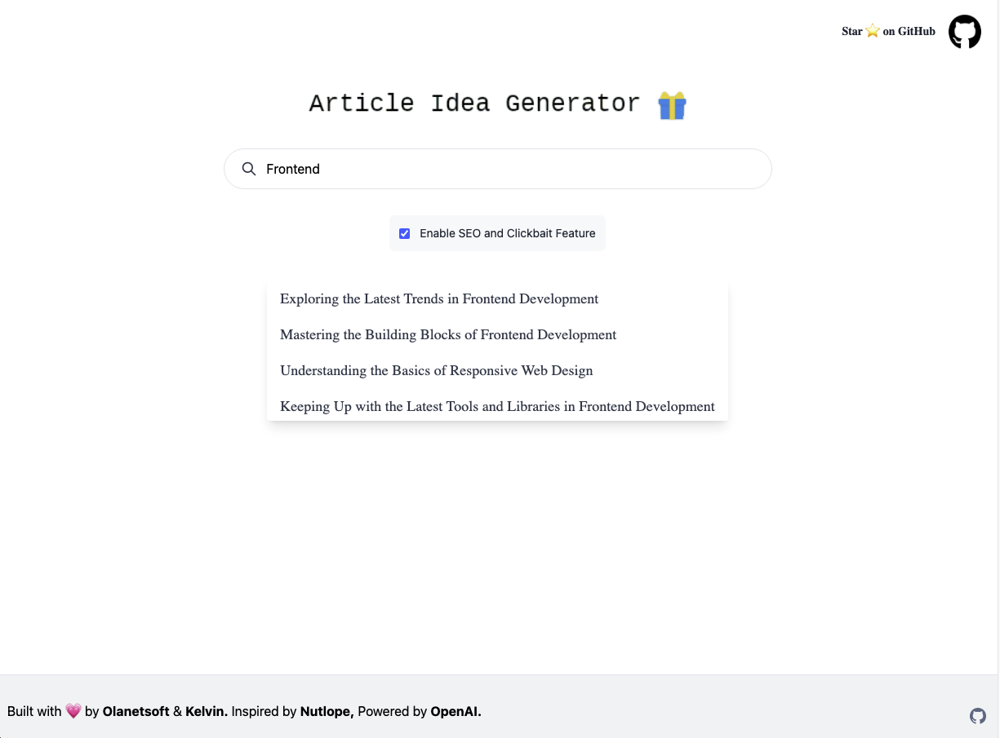

## [Article Idea Generator](https://www.articleideagenerator.com/)

This is a simple tool to generate article ideas for your blog or website. It's a great way to get started with your content marketing strategy.

## How to use

1. Go to [https://www.articleideagenerator.com/](https://www.articleideagenerator.com/)
2. Enter any related keyword to your topic and click `Enter`
3. 4 different article Idea will be generated, Copy any of the generated article idea
4. Paste it into your favorite content editor
5. Write your article
6. Publish it

## Running Project Locally

1. Fork the repo
2. Clone the repo
3. After cloning the repo, go to [OpenAI](https://beta.openai.com/account/api-keys) to make an account and generate your API key
4. Rename `.env.example` file on the root of the project to `.env`, then paste your API key in the `.env` file
5. Run `npm install` to install all the dependencies
6. Run `npm run dev` to start the project
7. Go to [http://localhost:3000](http://localhost:3000) to see the project running

## Contributing

If you want to contribute to this project, please read the [contributing guide](./CONTRIBUTING.md). If you have any ideas or suggestions, feel free to open an issue or a pull request. 

If you like this project, please give it a star ⭐️

## Contributors 💪

Thanks a lot for spending your time helping `Article Idea Generator` grow. Happy Hacking 🍻

## Stargazers ⭐️

