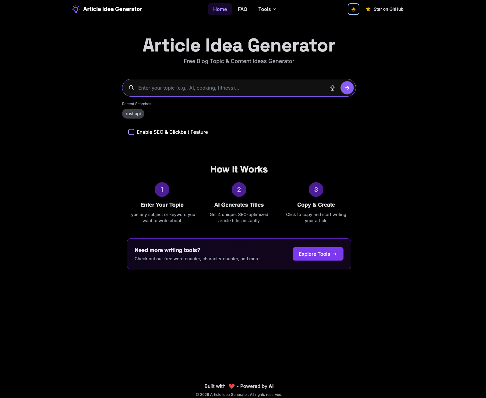
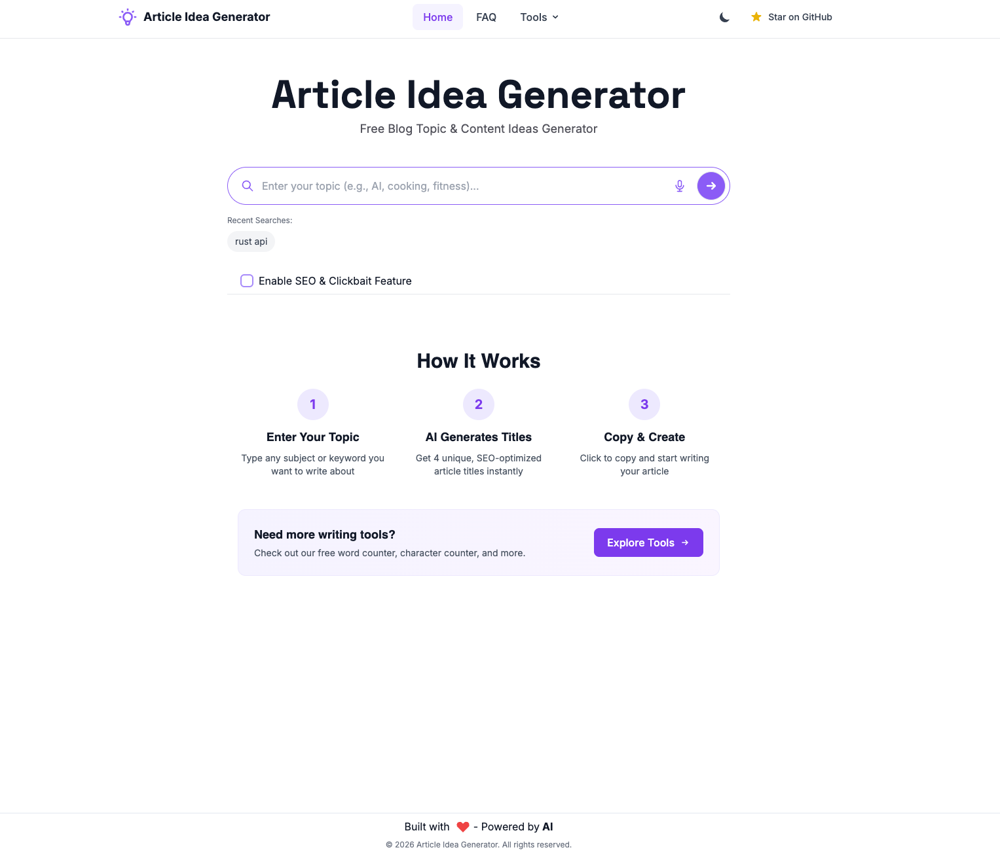

[](https://gitpod.io/#https://github.com/Olanetsoft/article-idea-generator) [](https://github.com/Olanetsoft/article-idea-generator/issues)
[](https://img.shields.io/github/forks/Olanetsoft/article-idea-generator)
[](https://img.shields.io/github/stars/Olanetsoft/article-idea-generator)
[](https://github.com/Olanetsoft/article-idea-generator)
[](https://opensource.org/licenses/MIT) [](https://github.com/Olanetsoft/article-idea-generator)

## [Article Idea Generator](https://www.articleideagenerator.com/)

Generate article ideas using GPT-4o-mini. Enter a topic, get 4 title suggestions with optional SEO optimization.

**Plus free tools** — Word Counter, QR Code Generator, and more.

### Features

**Article Generator**

- GPT-4o-mini powered title generation
- SEO & Clickbait mode toggle
- Character count with SEO indicators (50-60 chars ideal)
- Abstract generation for any title
- Recent searches (last 5)
- Share to Twitter/LinkedIn

**Free Tools**

- **[Word Counter](https://www.articleideagenerator.com/tools/word-counter)** — Words, characters, sentences, paragraphs, reading/speaking time, keyword density
- **[QR Code Generator](https://www.articleideagenerator.com/tools/qr-code-generator)** — 17+ QR types: URL, WiFi, vCard, social media (Twitter, YouTube, Facebook), crypto payments (Bitcoin, Ethereum, Cardano, Solana), App Store links. Custom colors, **logo support**, frames, style presets, **batch generation** (multiple QR codes at once with ZIP download). PNG/SVG/JPEG export. UTM tracking compatible
- **[Title Case Converter](https://www.articleideagenerator.com/tools/title-case)** — 16 case styles (AP, Chicago, APA, camelCase, snake_case, kebab-case, etc). Auto-detection, one-click copy
- **[JSON Formatter](https://www.articleideagenerator.com/tools/json-formatter)** — Format, minify, validate JSON. Customizable indentation (2/4/8 spaces, tabs). Real-time validation with line/column error positions. Structure analysis (keys, objects, arrays, depth). File upload/download support
- **[URL Shortener](https://www.articleideagenerator.com/tools/url-shortener)** — Free URL shortener, no signup required. QR code generation for short links. Link history saved locally. Perfect for social media and marketing
- **[Cover Image Generator](https://www.articleideagenerator.com/tools/cover-image-generator)** — The most feature-rich free cover image maker. **24+ gradient presets** (vibrant, dark, nature, minimal), **16 platform sizes** (Twitter, LinkedIn, Dev.to, Medium, Hashnode, Instagram, Pinterest, YouTube & more), **12 pattern overlays**, **8 theme layouts**, **30+ dev icons** (React, TypeScript, Python, etc.), **8 quick-start templates**. Custom logo upload, download all sizes at once, settings persistence. No signup required
- **Character Counter** _(Coming Soon)_
- **Reading Time Calculator** _(Coming Soon)_
- **Headline Analyzer** _(Coming Soon)_

**Platform**

- Dark mode
- Mobile responsive
- PWA (installable, works offline)
- Keyboard accessible
- `/llms.txt` for AI assistants

<p align="center">
  
  
</p>

## Usage

### Article Generator

1. Go to [articleideagenerator.com](https://www.articleideagenerator.com/)
2. Enter a topic
3. (Optional) Enable SEO & Clickbait mode
4. Click search or press Enter
5. Click a title to copy, or click the document icon for an abstract

### Word Counter

1. Go to [/tools/word-counter](https://www.articleideagenerator.com/tools/word-counter)
2. Paste or type text
3. View stats: words, characters, sentences, paragraphs, reading time, speaking time, top keywords

### QR Code Generator

1. Go to [/tools/qr-code-generator](https://www.articleideagenerator.com/tools/qr-code-generator)
2. Select QR type:
   - **Basic**: URL, text, email, phone, SMS, WiFi, vCard, location, calendar
   - **Social**: Twitter/X, YouTube, Facebook, App Store
   - **Payments**: Bitcoin, Ethereum, Cardano, Solana
3. Fill in the fields
4. Customize colors, add logo, choose frame style (optional)
5. Download as PNG, SVG, or JPEG

**Batch Mode** (URL type):

- Switch to Batch tab
- Enter multiple URLs (one per line), optionally with labels: `My Site,https://example.com`
- Or upload a CSV/TXT file
- Customize styles for all QR codes
- Download all as ZIP

### Title Case Converter

1. Go to [/tools/title-case](https://www.articleideagenerator.com/tools/title-case)
2. Type or paste your text
3. View all 16 case conversions instantly
4. Click any card to copy that style
5. Use sample texts to test different formats

### JSON Formatter

1. Go to [/tools/json-formatter](https://www.articleideagenerator.com/tools/json-formatter)
2. Paste or type JSON (or upload a .json file)
3. Click **Format** to beautify with chosen indentation
4. Click **Minify** to compress for production
5. View real-time validation and structure stats (keys, depth, types)
6. Download or copy the result

### URL Shortener

1. Go to [/tools/url-shortener](https://www.articleideagenerator.com/tools/url-shortener)
2. Paste any long URL
3. Click **Shorten URL**
4. Copy the short link or generate a QR code
5. Recent links are saved locally for quick access

### Cover Image Generator

1. Go to [/tools/cover-image-generator](https://www.articleideagenerator.com/tools/cover-image-generator)
2. Enter your article title and optional subtitle/author
3. **Content Tab**: Add title, subtitle, author name, upload logo or choose dev icon
4. **Style Tab**: Pick gradient (24+ presets or custom colors), pattern overlay, text color, font
5. **Layout Tab**: Choose theme layout, text alignment, padding, border radius
6. **Export Tab**: Select size preset (16 platforms) or custom dimensions
7. Click **Download** for single size or **Download All Sizes** for all 15 images at once
8. Use **Quick Templates** button for pre-configured styles

## How it works

Uses [OpenAI GPT-4o-mini](https://openai.com/api/):

1. Your topic + settings → prompt
2. Prompt → GPT-4o-mini (temp: 0.7, max tokens: 800)
3. Returns 4 article titles
4. Abstracts use a separate prompt for natural writing style

### Tech Stack

- Next.js 13 + TypeScript
- OpenAI GPT-4o-mini
- Tailwind CSS
- Framer Motion
- Deployed on Vercel

## Local Development

### Requirements

- Node.js 14+
- OpenAI API key

### Setup

```bash
git clone https://github.com/YOUR_USERNAME/article-idea-generator.git
cd article-idea-generator
cp .env.example .env
# Add your OPENAI_API_KEY to .env
npm install
npm run dev
```

Open [http://localhost:3000](http://localhost:3000)

### Environment Variables

- `OPENAI_API_KEY` — Required. Get from [platform.openai.com](https://platform.openai.com/account/api-keys)

## Contributing

See [CONTRIBUTING.md](./CONTRIBUTING.md).

## Contributors

[](https://github.com/Olanetsoft/article-idea-generator/graphs/contributors)

## License

MIT
